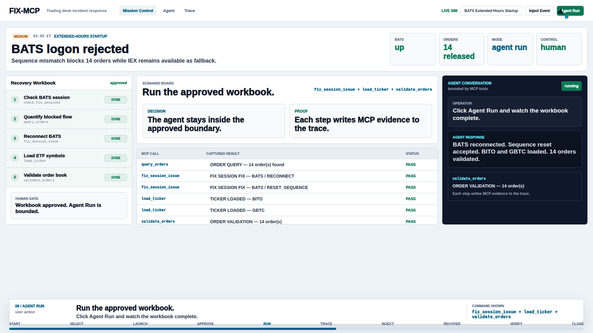

# FIX-MCP

[](https://github.com/henryurlo/fix-mcp-server/actions/workflows/ci.yml)
[](tests/)
[](CHANGELOG.md)
[](LICENSE)
[](https://modelcontextprotocol.io/)
[](docker-compose.yml)

> **AI agents can write FIX messages. They cannot recover a stuck session, validate a NewOrderSingle, or pause a TWAP that is behind schedule. FIX-MCP gives them the trading-ops brain to do all three through explicit MCP tools, approval gates, and auditable evidence.**



FIX-MCP is an open-source professional demo for AI-assisted trading operations. It gives Claude, GPT, Gemini, and any MCP-capable agent a controlled tool surface for diagnosing and resolving realistic FIX, OMS, reference-data, venue, and algo incidents while a human operator stays responsible for approval and final control.

The demo runs against a simulated broker-dealer environment. The product thesis is broader: MCP is the right interface for letting LLMs work with real operational systems without giving them magic, unbounded access to the desk.

## What It Includes

- **22 MCP tools** for session repair, order triage, reference-data updates, venue state, algo management, scenario scoring, and trace capture.
- **13 real-world desk scenarios** covering 02:05 ET pre-dawn startup through 16:32 ET after-hours dark-pool failures.
- **Human-led workflow**: investigate, approve workbook, run approved recovery, then stress test only after the baseline path is understood.
- **Mission Control dashboard** with case brief, workbook, operator rail, trace, FIX wire, terminal, manual runbook, and copilot panel.
- **Production-shaped stack**: Python MCP server, REST API, Next.js console, PostgreSQL 16, Redis 7, Docker Compose, and async FIX TCP connector scaffolding.

## Who This Is For

| You are... | FIX-MCP gives you... |
|---|---|
| **Broker-dealer ops engineer** | A working model for AI-assisted incident triage during market hours. |
| **OMS / EMS vendor** | A reference implementation for adding MCP to trading workflows. |
| **AI builder** | A domain-rich tool surface for agents that need to reason about trading operations. |
| **VC / fintech evaluator** | A concrete artifact showing where AI-in-trading infrastructure is heading. |

## Featured Walkthrough — BATS Startup at 02:05 ET

The desk loads `bats_startup_0200`.

**Incident:** BATS Logon is rejected because the counterparty expects sequence `2450`, while the session was reset to `1`. Eight overnight GTC orders are blocked, two ETF symbols are missing from extended-hours reference data, and IEX is healthy as fallback.

The operator asks the copilot to investigate. The agent uses MCP tools:

```text
list_scenarios       Scenario Loaded: bats_startup_0200
check_fix_sessions   BATS down; sequence mismatch detected
query_orders         ORDER QUERY — 14 order(s) found
```

The agent proposes a recovery workbook:

```text
1. Check BATS session
2. Quantify blocked flow
3. Reconnect BATS
4. Reset BATS sequence if needed
5. Load missing ETF symbols
6. Validate orders released
```

The human approves the workbook. Agent Run executes only the approved path:

```text
fix_session_issue    BATS reconnect released stuck orders
fix_session_issue    BATS reset_sequence accepted
load_ticker          BITO loaded
load_ticker          GBTC loaded
validate_orders      14 PASS, 0 FAIL
```

Then, and only then, the operator uses **Stress Lab** to inject a sequence-gap event and prove the system pauses, re-triages, recovers, resumes, and records the trace.

That is the operating pattern: **baseline first, pressure test second, evidence always.**

## Quick Start

```bash
git clone https://github.com/henryurlo/fix-mcp-server.git
cd fix-mcp-server
docker compose up -d
```

Open **http://localhost:3000**.

Login with `henry` / `henry`, `admin` / `admin`, or click **Demo Mode**.

| Service | URL | Purpose |
|---|---|---|
| Mission Control | http://localhost:3000 | Trading-ops dashboard and guided demo workflow |
| REST API | http://localhost:8000 | MCP tool dispatch, scenarios, system status |
| MCP stdio | `docker compose run --rm mcp-server` | Direct MCP protocol entry point |

No Node or Python is required on your host for the Docker demo.

## Python Development

```bash
python -m pip install -e ".[dev]"
python -m fix_mcp.api
```

In another terminal:

```bash
npm install
npm run dev
```

The Next.js console reads `BACKEND_URL`, defaulting to `http://127.0.0.1:8000`.

## MCP Client Configuration

For a local MCP client that can launch the Python entry point:

```json
{
  "mcpServers": {
    "fix-mcp": {
      "command": "fix-mcp-server"
    }
  }
}
```

For an HTTP-capable MCP client/proxy:

```json
{
  "mcpServers": {
    "fix-mcp": {
      "command": "npx",
      "args": ["-y", "@anthropic-ai/mcp-remote@latest"],
      "env": {
        "MCP_URL": "http://localhost:8000/mcp"
      }
    }
  }
}
```

## Demo vs Production

| Component | Demo | Production / Consulting Engagement |
|---|---|---|
| FIX sessions | Simulated Python objects | Real FIX engine logs and session controls |
| OMS | In-memory order state | OMS database/API integration |
| Reference data | Preloaded JSON | Vendor feeds, DTCC data, internal symbology |
| Monitoring | Scenario engine preloads incidents | Datadog, Splunk, Grafana, or internal event streams |
| Execution | Updates simulated state | Sends approved FIX messages or calls approved OMS APIs |
| MCP tools | Same tool surface | Same interface, production adapters |
| Domain intelligence | Same prompts and logic | Tuned to client workflows, venues, and controls |

The professional work is the integration layer: wire the same MCP interface and trading-ops knowledge into a firm's real logs, OMS, reference data, monitoring, and approval workflow.

## Documentation

- [Scenario catalog](docs/scenarios.md)
- [Architecture](docs/architecture.md)
- [Production integration notes](docs/production.md)
- [Operator demo flow](docs/operator-demo-flow.md)
- [Remotion demo scripts](docs/remotion-executive-demos.md)

## Built By Henry Urlo

Built by **Henry Urlo**, a trading-infrastructure engineer with 15 years across institutional FIX, OMS, broker-dealer operations, and fintech systems at Nomura, Instinet, Lime Brokerage, tZERO, and Joseph Gunnar.

FINRA Series 3, 7, 63.

Available for retainer engagements with broker-dealers, OMS/EMS vendors, and fintech teams building AI-augmented trading operations.

Contact: [henry@frontierdesk.io](mailto:henry@frontierdesk.io)

## License

MIT. See [LICENSE](LICENSE).
